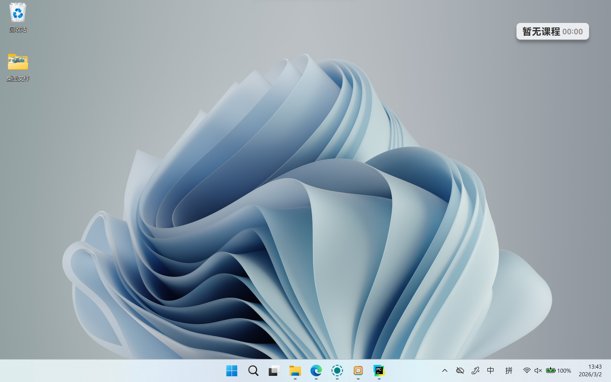
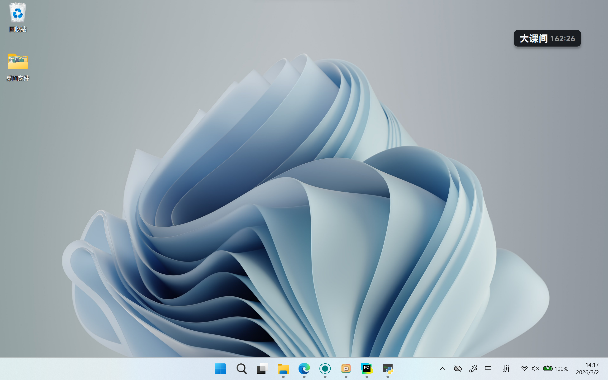

简体中文 | <a href="/docs/readme/README.en_US.md">English</a> | <a href="/docs/readme/README.ja.md">日本語</a>

  

<h1 align="center">Class Widgets 1_plus</h1>

Class Widgets 1 的简易修改版（Fork）

> ⚠️ 该项目为基于上游项目的非官方修改版本，不隶属于原项目官方团队。

## 特性
- **可以在龙芯Loongarch处理器上转译运行，拥有与原项目几乎相同的兼容性**
- **更小的浮窗**，更小的屏幕空间占用
- 由 Python 编写的**插件**系统和插件广场（详见最新构建）
- 将今日的课程安排以**小组件**的样式为你呈现；
- 具有 [上下课提醒](https://www.yuque.com/rinlit/class-widgets_help/fv2ou1i1ngap0hrl) 和预备铃，支持通过TTS进行提醒；
- 拥有主题系统支持你高度自定义。
- 简洁直观的 [课程表编辑](https://www.yuque.com/rinlit/class-widgets_help/oozelh8r56tmw0xb) 界面；
- 同时存储多个课程表文件，并能在各个 Class Widgets 导入和导出；
- 支持 [**通用课程表交换格式**（CSES）](https://github.com/SmartTeachCN/CSES) ，能在不同格式间转换；
- 提供快捷的调休、换课 [应对方案](https://www.yuque.com/rinlit/class-widgets_help/gc4epffu7g5bf9os)。
- 提供“天气”、“自定义倒计时”等实用小组件；
- 通过 [“自定义”](https://www.yuque.com/rinlit/class-widgets_help/qyly70ht1ogge1pi) 个性化你的 Class Widgets；
- 具有亮/暗色主题，还能根据系统设置自动切换； ……
## 修改内容（相对上游）

- 新增/调整小尺寸浮窗布局
- ......
## 修改部分的软件截图

#### 小尺寸浮窗

## 安装与使用

> [!TIP]
> 可参考原项目 [Class Widgets 官方文档](https://www.yuque.com/rinlit/class-widgets_help/gs3gsbms1iivgibm)。

下载发布页中的压缩包，解压后运行 `ClassWidgets.exe` 即可。  
可通过托盘菜单进入设置或退出程序。

> [!IMPORTANT]
> 若你发布了二进制（如 exe/zip），请确保能获取与该版本对应的完整源码（见下方许可证说明）。

## 许可证（License）

本项目基于 **GNU General Public License v3.0 (GPL-3.0)** 发布。  
详情见 [LICENSE](./LICENSE)。

本项目是对上游项目的修改版本（Fork）：

- Upstream: [Class-Widgets/Class-Widgets](https://github.com/Class-Widgets/Class-Widgets)
- 上游版权：Copyright © 2025 RinLit.
- 本修改版权：Copyright © 2026 YU322142.
### GPL 合规说明（分发二进制时）

若你分发本项目的可执行文件或打包产物（exe/zip），必须同时提供该版本对应的完整源码，  
或提供明确、有效的源码获取方式（例如同一仓库对应 tag/release）。

### 非官方声明

本项目为**非官方** fork，**不隶属于**、**不代表**、也**未获得**上游官方背书（除非另行明确说明）。
### 名称与素材说明

项目名称、Logo、部分美术/图标资源的权利可能归原作者或各自权利方所有。  
请在再分发时自行确认相关资源许可范围。

## 致谢

### 上游项目

- [Class-Widgets/Class-Widgets](https://github.com/Class-Widgets/Class-Widgets)

感谢上游维护者与所有贡献者的长期投入。

### 第三方库和框架

- [PyQt5](https://www.riverbankcomputing.com/static/Docs/PyQt5/)
- [PyQt-Fluent-Widgets](https://github.com/zhiyiYo/PyQt-Fluent-Widgets)
- [Loguru](https://github.com/Delgan/loguru)
- [Requests](https://github.com/psf/requests)

### 资源

- [SF Symbols](https://developer.apple.com/cn/sf-symbols/)（部分图标已做修改）
- [和风天气图标](https://icons.qweather.com/)（部分图标已做修改）
- [Segoe Fluent Icons](https://learn.microsoft.com/zh-cn/windows/apps/design/style/segoe-fluent-icons-font)（部分图标已做修改）
- [HarmonyOS Sans](https://developer.huawei.com/consumer/cn/design/resource/)

## 社区与反馈

- 本项目社区：暂无
- 上游社区（仅供参考）：
  - [Discussions](https://github.com/orgs/Class-Widgets/discussions)
  - [QQ群](http://qm.qq.com/cgi-bin/qm/qr?_wv=1027&k=yHXKCAjOxlpTpJ4mNdXm0mxOneYUinRs&authKey=sd3%2F06iGdOZUjkXXPBeIzGnFDIeYwmdwuM8dhk25fi%2B1CUL32MkeN2EEfjdo2pzE&noverify=0&group_code=169200380)
  - [Discord](https://discord.gg/EFF4PpqpqZ)

---

这仅是我作为新人的练习作品，欢迎提供更多意见！
